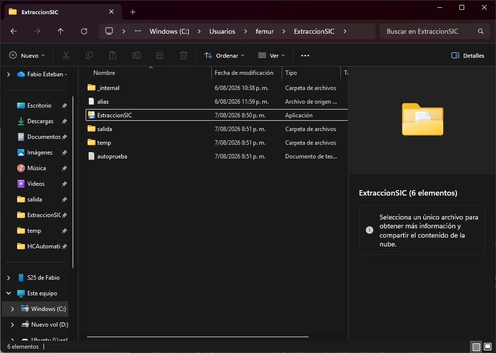
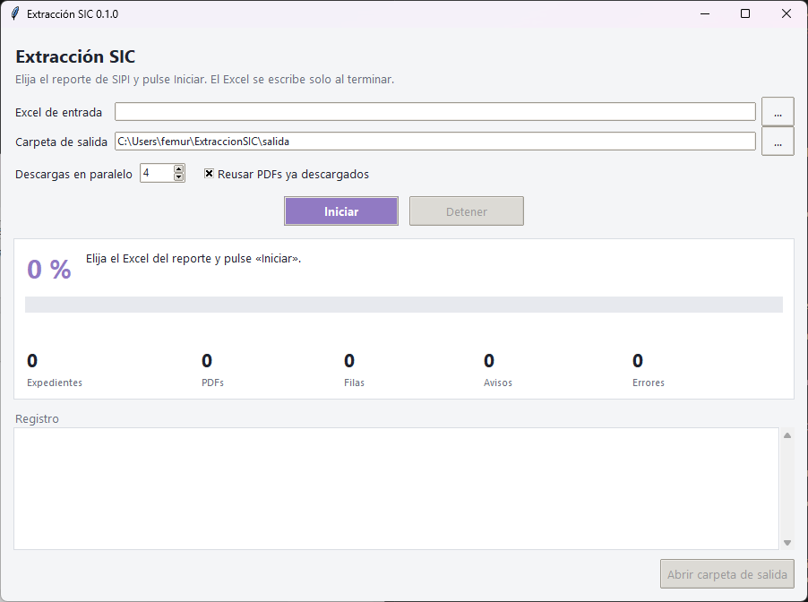
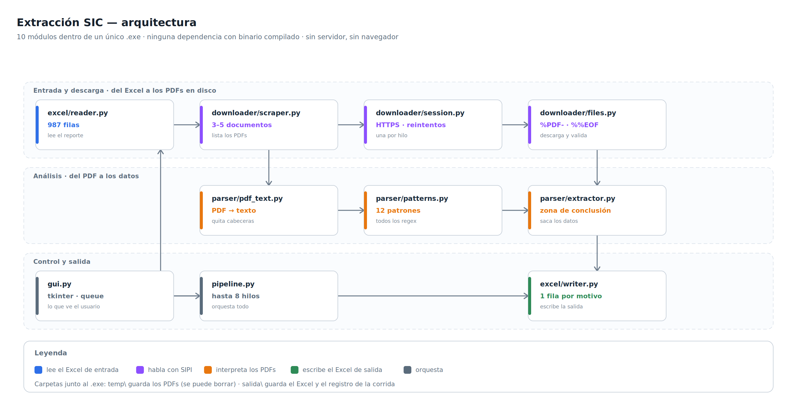
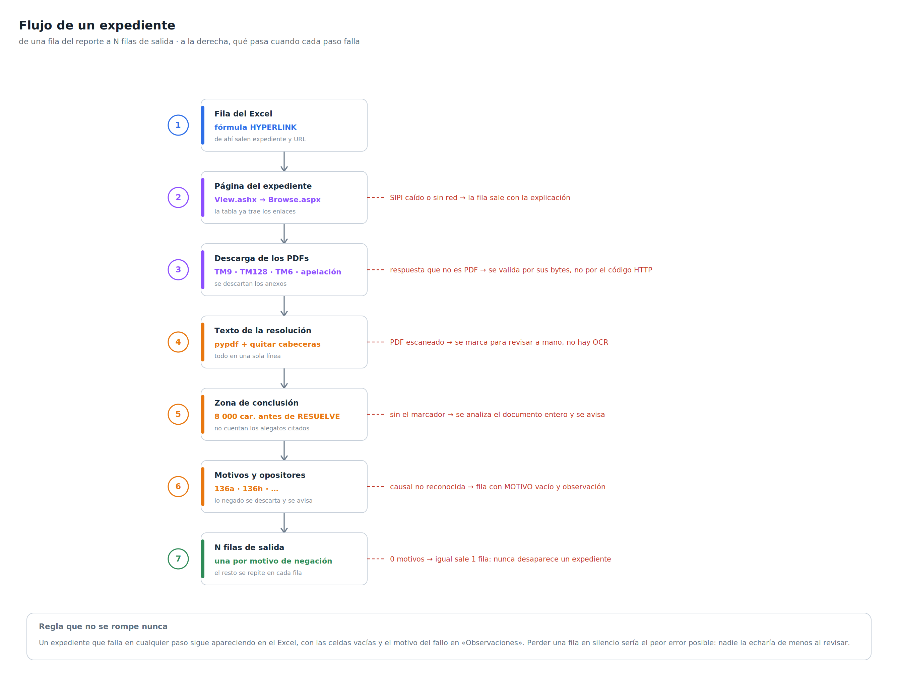

# Extracción SIC — manual

Versión 0.1.0 · 7 de agosto de 2026

1. [Qué hace](#1-qué-hace)
2. [Manual de uso](#2-manual-de-uso)
3. [El Excel de salida](#3-el-excel-de-salida)
4. [Arquitectura](#4-arquitectura)
5. [Problemas frecuentes](#5-problemas-frecuentes)
6. [Para desarrolladores](#6-para-desarrolladores)

---

## 1. Qué hace

Este programa hace en menos de una hora lo que antes se hacía expediente por expediente a
mano.

Se le entrega el Excel que exporta SIPI y por cada expediente entra a su ficha en
`sipi.sic.gov.co`, descarga las resoluciones en PDF, las lee, y saca de ellas la naturaleza
de la marca, quién presentó oposición, si esa oposición se declaró fundada y **por qué
causales se negó el registro**.

El resultado es un Excel nuevo. Cuando un expediente se niega por varias causales, sale
**una fila por cada causal**, repitiendo el resto de la información. Los PDFs quedan
guardados en el disco por si hay que consultarlos. En promedio, alrededor de una fila de
cada cinco queda marcada para revisar a mano.

---

## 2. Manual de uso

### Instalar

No hay instalador y no hace falta permiso de administrador.

1. Botón derecho sobre `ExtraccionSIC.zip` → **Extraer todo**. El Escritorio o
   `C:\Users\<usuario>\Documentos` sirven.
2. Entrar en la carpeta `ExtraccionSIC` y doble clic en **`ExtraccionSIC.exe`**.

> **Descomprimir de verdad.** Hacer doble clic dentro del `.zip` sin extraerlo hace que
> Windows lo abra desde una carpeta temporal y el programa no encuentra sus archivos.

> **No funciona desde una carpeta de red.** Si la ruta empieza por `\\servidor\...`, el
> programa no arranca. Copiar la carpeta a `C:` o a una unidad con letra asignada (`Z:`).

La primera vez Windows muestra la pantalla azul *«Windows protegió su PC»*: es lo normal en
un programa sin firma digital. Pulsar **Más información** → **Ejecutar de todas formas**.
Solo hay que hacerlo una vez. Si el antivirus borra o bloquea el archivo, es un falso
positivo de PyInstaller: pedir a TI que añada la carpeta como excepción.

### La carpeta del programa



| Elemento | Para qué sirve |
|---|---|
| `ExtraccionSIC.exe` | el programa; es lo único que hay que abrir |
| `_internal\` | librerías del ejecutable — no tocar |
| `alias.json` | diccionario de nombres cortos de opositores; se puede editar a mano |
| `salida\` | los Excel generados, el registro de cada corrida y los PDFs en `soportes\` |
| `temp\` | caché de trabajo; **se puede borrar entera** y la siguiente corrida la rehace |
| `autoprueba.txt` | resultado de la comprobación que se hace al construir el `.exe` |

Nunca se sobrescribe nada: cada corrida crea un Excel y un registro nuevos, y los PDFs que
ya estaban se reutilizan. En `salida\soportes\` hay un subdirectorio por expediente con sus
PDFs. Un reporte completo ocupa varios cientos de MB.

### La ventana



| Control | Para qué sirve |
|---|---|
| **Excel de entrada** | el reporte exportado de SIPI. Es lo único obligatorio |
| **Carpeta de salida** | dónde se escriben el Excel y los PDFs. Ya viene puesta |
| **Descargas en paralelo** | de 1 a 8. Subirlo no acelera mucho: el cuello de botella es SIPI. Bajarlo a 1 o 2 va más suave si la red va justa o salen muchos errores |
| **Reusar PDFs ya descargados** | marcado, una segunda corrida no vuelve a bajar nada. Sirve para reanudar tras un corte de red |
| **Iniciar** / **Detener** | *Detener* termina los expedientes en curso y escribe el Excel con lo que llevaba: no se pierde el trabajo hecho |
| **Registro** | lo que va pasando, con los avisos y errores según ocurren |
| **Abrir carpeta de salida** | se habilita al terminar |

### Correr una extracción

1. Pulsar **…** junto a *Excel de entrada* y elegir el reporte exportado de SIPI.
2. Todo lo demás ya viene puesto. Pulsar **Iniciar**.
3. Esperar. Un reporte completo tarda menos de una hora, según lo cargado que esté SIPI.
4. Al terminar aparece un resumen. Pulsar **Abrir carpeta de salida**.

Mientras corre, el panel muestra el porcentaje, la barra de avance y cinco contadores:

| Contador | Qué cuenta |
|---|---|
| Expedientes | filas del reporte ya procesadas |
| PDFs | documentos descargados en esta corrida (los reutilizados no cuentan) |
| Filas | las que llevará el Excel de salida — **es mayor que «Expedientes»** |
| Avisos | cosas que conviene revisar a mano; están en la columna «Observaciones» |
| Errores | expedientes que no se pudieron leer. **Salen igual en el Excel**, con la celda vacía y la causa |

El Excel se escribe al terminar, no durante la corrida.

---

## 3. El Excel de salida

Las cabeceras van en la **fila 2**; los datos empiezan en la 3. La cabecera **gris** marca
las columnas que vienen del Excel que se entregó y la **amarilla** las que produce este
programa. El expediente de la columna 1 lleva enlace a su ficha en SIPI.

| # | Columna | De dónde sale | Valores |
|---|---|---|---|
| 1 | Número de Expediente | del reporte de entrada | `SD2022/0000017`, con enlace a SIPI |
| 2 | Marca | del reporte de entrada | texto |
| 3 | Naturaleza | **de la resolución** | `Nominativa`, `Mixta`, `Figurativa`, `Tridimensional`, `3D` |
| 4 | Presenta Oposición | **de la resolución** | `Sí` / `No` |
| 5 | Opositor 1 | **de la resolución** | nombre tal como lo escribe la SIC |
| 6 | Nombre corto OPOSITOR 1 | diccionario `alias.json` | vacío si no está en el diccionario |
| 7 | Art OP 1 | **de la resolución** | artículos que invocó, p. ej. `136a, 136b` |
| 8 | Fundada OP 1 | **de la resolución** | `SI` / `NO` |
| 9 | Opositor 2 | **de la resolución** | vacío si solo hubo un opositor |
| 10 | Nombre corto OPOSITOR 2 | diccionario `alias.json` | igual que la 6 |
| 11 | Art Opositor 2 | **de la resolución** | igual que la 7 |
| 12 | Fundada OP 2 | **de la resolución** | igual que la 8 |
| 13 | **MOTIVO Negación** | **de la resolución** | **una sola causal**, p. ej. `136a` |
| 14 | Apelación a la negación | tabla de documentos del expediente | `SI` / `no` |
| 15 | Titular | del reporte de entrada | texto |
| 16 | NIZA | del reporte de entrada | clases |
| 17 | **Motivo #** | calculada | `1`, `2`, `3`… |
| 18 | **Motivos totales** | calculada | cuántas causales tiene ese expediente |
| 19 | **Observaciones** | calculada | qué revisar a mano, en texto claro |
| 20 | Descripción de Productos y Servicios | del reporte de entrada | texto largo; va de última a propósito |

**Las filas moradas** son los expedientes sin opositor: las columnas 4 a 12 quedan vacías
con razón. Si una fila tiene esas columnas vacías y **no** está morada, conviene mirar
«Observaciones».

El programa nunca inventa un dato: cuando no está seguro deja la celda vacía y escribe en
**Observaciones** por qué. Las que piden atención de verdad son las que dicen *«no se pudo
determinar la causal»* o *«revisar a mano»*: hay que abrir el PDF en `salida\soportes\`.

### La regla de una fila por motivo

Un expediente negado por dos causales genera dos filas idénticas salvo `MOTIVO Negación`:

| Expediente | Marca | Opositor 1 | MOTIVO Negación | Motivo # | Motivos totales |
|---|---|---|---|---|---|
| SD2022/0097089 | BASIC FOODING MILKO | SOCIETE DES PRODUITS NESTLE SA | `136a` | 1 | 2 |
| SD2022/0097089 | BASIC FOODING MILKO | SOCIETE DES PRODUITS NESTLE SA | `136h` | 2 | 2 |

Por eso el Excel tiene más filas que expedientes: para contarlos hay que filtrar por
`Motivo # = 1`. Las filas de un mismo expediente salen siempre juntas y en el orden en que
las causales aparecen en la resolución. Un expediente sin causal detectada sale igualmente,
con una sola fila y la explicación en «Observaciones». Nunca desaparece nadie.

---

## 4. Arquitectura



Diez módulos dentro de un único ejecutable. No hay servidor, base de datos ni navegador: el
programa hace peticiones HTTPS normales y guarda todo en archivos junto al `.exe`.



El diagrama de flujo marca a la derecha qué ocurre **cuando cada paso falla**. La regla que
no se rompe nunca: un expediente que falla sigue apareciendo en el Excel, con las celdas
vacías y el motivo en «Observaciones». Perder una fila en silencio sería el peor error
posible, porque nadie la echaría de menos al revisar.

---

## 5. Problemas frecuentes

| Síntoma | Qué hacer |
|---|---|
| El antivirus borra o bloquea el `.exe` | Falso positivo de PyInstaller. Pedir a TI que añada la carpeta como excepción |
| «Windows protegió su PC» (pantalla azul) | SmartScreen. *Más información* → *Ejecutar de todas formas*. Solo la primera vez |
| «Windows no encuentra el archivo "\"» | El programa está en una carpeta de red. Copiarlo a `C:` o a una unidad con letra |
| «No se pudo escribir "…xlsx": el archivo está abierto en Excel» | Cerrar el Excel de salida y reintentar. El programa no toca el archivo abierto |
| Muchos errores de red seguidos | SIPI está caído o limitando el ritmo. Bajar «Descargas en paralelo» a 2, esperar y relanzar. Si el sitio abre en el navegador pero el programa falla, suele ser un **proxy corporativo**: no está soportado todavía |
| La corrida se interrumpió o terminó con errores | Relanzarla con el mismo Excel y **Reusar PDFs** marcado: solo reintenta lo que falló, y es mucho más rápida. Es normal que la primera pasada deje errores si SIPI está cargado |
| El Excel tiene más filas que expedientes | Es lo esperado: una fila por causal. Ver [la regla de una fila por motivo](#la-regla-de-una-fila-por-motivo) |
| La columna «Nombre corto» sale vacía | Ese dato no se deduce (`RED BULL GMBH` → `RedBull` es criterio humano). Sale de `alias.json`; si no está, la columna queda vacía y no pasa nada más |
| Tarda demasiado | Menos de una hora es lo normal. Si tarda mucho más, el problema es la red: bajar «Descargas en paralelo» a 2 |

---

## 6. Para desarrolladores

El programa corre igual desde el código fuente que empaquetado. El `.exe` es solo una
forma de repartirlo: no hay nada que dependa de estar empaquetado, salvo dónde se
resuelven las carpetas de trabajo (`app/utils/rutas.py`).

### Correr desde el código fuente

En Linux o WSL:

```bash
python -m venv .venv
.venv/bin/pip install -r requirements.txt -r requirements-dev.txt
.venv/bin/python -m app
```

En Windows, sin construir nada:

```powershell
py -m venv .venv-win
.\.venv-win\Scripts\python.exe -m pip install -r requirements.txt -r requirements-dev.txt
.\.venv-win\Scripts\python.exe -m app
```

Abre la misma ventana que el `.exe`. Es la vía más corta para probar un cambio sin
esperar a PyInstaller, y la única que funciona si el Python instalado no sirve para
empaquetar (ver el aviso de abajo).

En Linux hace falta `tkinter`, que no viene con el Python de Ubuntu:
`sudo apt install python3-tk`. El resto del programa —lectura del Excel, descargas,
extracción, escritura— no lo necesita.

### Correr las pruebas

```bash
.venv/bin/python -m pytest -q               # toda la batería, un par de minutos
.venv/bin/python -m pytest -q --cov=app     # con cobertura
.venv/bin/python -m pytest -m live          # opt-in: pega contra SIPI de verdad
```

Casi todo corre **offline**, contra respuestas reales de SIPI grabadas en
`tests/fixtures/http/`. Para volver a grabarlas, `python -m tests.make_fixtures`. Las
pruebas de `tests/test_windows.py` solo corren en Windows y se omiten en Linux.

### Reconstruir el `.exe`

> **El Python importa.** Hay que construir con CPython de
> [python.org](https://www.python.org/downloads/windows/). El build que reparten la
> Microsoft Store y el *Python Install Manager* (`%LOCALAPPDATA%\Python\pythoncore-*`)
> guarda Tcl/Tk **dentro de un zip embebido**, y PyInstaller no puede copiarlo de ahí:
> el `.exe` se construye sin errores y luego muere al arrancar con
> `FileNotFoundError: Tcl data directory ... _internal\_tcl_data not found`.
> Para saber cuál tienes:
>
> ```powershell
> python -c "import tkinter; print(tkinter.Tcl().eval('info library'))"
> ```
>
> Si la ruta empieza por `//zipfs:/`, ese intérprete no sirve para empaquetar. Sí sirve
> para correr desde el fuente.

Desde Windows, con el proyecto en WSL:

```bat
pushd \\wsl.localhost\Ubuntu\home\<usuario>\perso\HCAutomation
construir_exe.bat
```

El script crea el entorno, **corre las pruebas y aborta si falla alguna**, empaqueta con
PyInstaller, copia el resultado a `%USERPROFILE%\ExtraccionSIC` y ejecuta la autoprueba del
ejecutable. Si algo no cuadra, no genera nada.

```bat
ExtraccionSIC.exe --autoprueba          -> importa todo y verifica las carpetas
ExtraccionSIC.exe --autoprueba --red    -> además hace una petición HTTPS real a SIPI
```

La segunda es la única que detecta que el paquete se quedó sin los certificados de
`certifi`, un fallo clásico de PyInstaller que no se ve importando módulos.

Los diagramas de la sección 4 se regeneran con `python docs/gen_diagramas.py`.

### Dónde tocar cada cosa

| Si cambia… | Tocar |
|---|---|
| la redacción de las resoluciones de la SIC | `app/parser/patterns.py` — **todos** los regex están ahí, cada uno con el texto real contra el que se verificó |
| cómo se decide un motivo | `app/parser/extractor.py`, funciones `zona_de_conclusion` y `extraer_motivos` |
| las columnas de salida | `app/excel/writer.py`, diccionario `CABECERAS` |
| el formato del reporte de entrada | `app/excel/reader.py`, diccionario `_COLUMNAS` (las columnas se buscan **por nombre**, no por posición) |
| tiempos, reintentos, número de hilos | `app/config.py` |
| los nombres cortos de opositores | `alias.json`, junto al `.exe` |

Al tocar `patterns.py` hay que correr `tests/test_extractor.py`, que tiene el catálogo de
casos adversariales, incluido el de la negación léxica.
