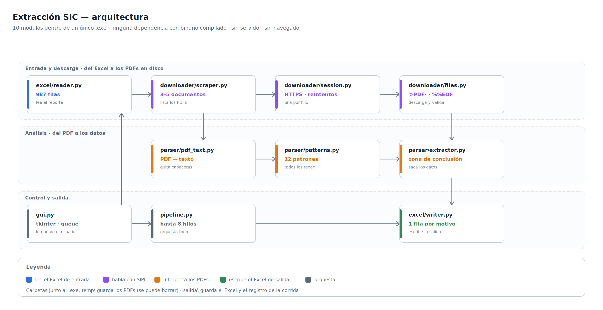
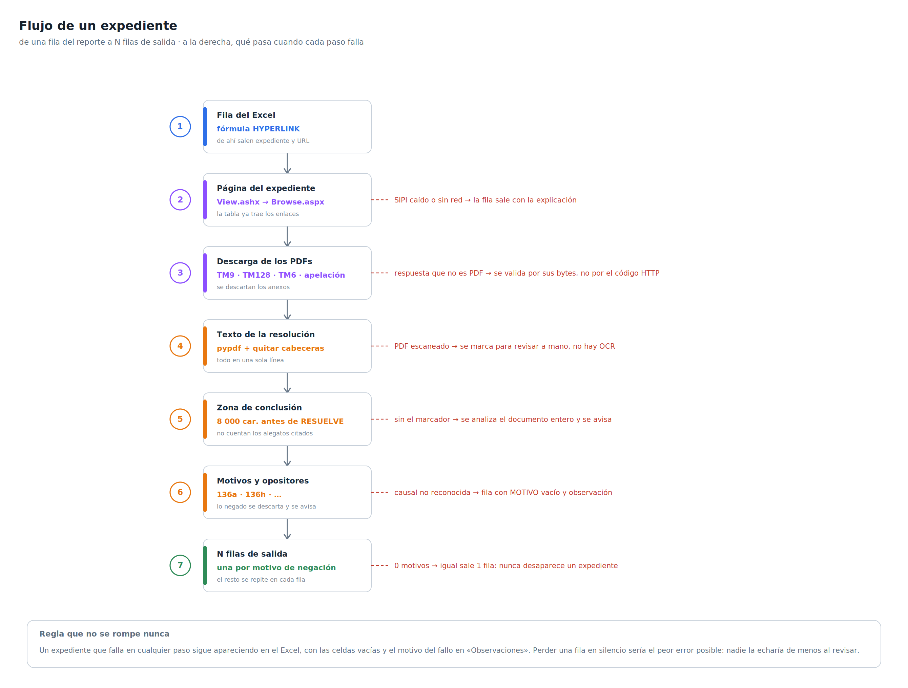

# Extracción SIC — Documentación técnica

Versión 0.1.0 · 8 de agosto de 2026

1. [Panorama](#1-panorama)
2. [Arquitectura](#2-arquitectura)
3. [Flujo de un expediente](#3-flujo-de-un-expediente)
4. [Los módulos](#4-los-módulos)
5. [Formatos de entrada y salida](#5-formatos-de-entrada-y-salida)
6. [Configuración](#6-configuración)
7. [Entorno de desarrollo](#7-entorno-de-desarrollo)
8. [Pruebas](#8-pruebas)
9. [Empaquetado y distribución](#9-empaquetado-y-distribución)
10. [Dónde tocar cada cosa](#10-dónde-tocar-cada-cosa)
11. [Limitaciones conocidas](#11-limitaciones-conocidas)

---

## 1. Panorama

Aplicación de escritorio que automatiza la extracción de información de resoluciones de
marcas publicadas en SIPI (`sipi.sic.gov.co`).

- **Entrada:** el Excel exportado por SIPI con el listado de expedientes.
- **Proceso:** por cada expediente, scraping de su ficha, descarga de los PDFs de
  resolución, extracción de datos del texto por expresiones regulares.
- **Salida:** un Excel nuevo con una fila por causal de negación, más los PDFs en disco.

Decisiones de fondo:

| Decisión | Motivo |
|---|---|
| Peticiones HTTPS directas, sin navegador | El HTML de SIPI ya trae los enlaces a los PDFs; no hace falta ejecutar JavaScript ni arrastrar un navegador embebido |
| Sin servidor ni base de datos | Todo el estado vive en archivos junto al ejecutable. Simplifica el despliegue en un equipo corporativo sin permisos |
| Extracción por expresiones regulares | El corpus es reducido y de redacción muy estable; concentrar los patrones en un módulo hace que adaptarse a un cambio de redacción sea editar un archivo |
| Nunca inferir un dato dudoso | Un dato inventado pasa la revisión humana sin que nadie lo note; una celda vacía con explicación, no |

Tecnologías: Python 3, `requests` (HTTP), `pdfplumber` (texto de PDF), `openpyxl`
(Excel), `tkinter` (interfaz), `pytest` + `hypothesis` (pruebas), PyInstaller
(empaquetado).

---

## 2. Arquitectura



Diez módulos dentro de un único ejecutable. `pipeline.py` es el único que conoce el
proceso completo; los demás no se llaman entre sí, todos cuelgan de él.

```
app/
  __main__.py      punto de entrada (ventana o modo autoprueba)
  gui.py           ventana tkinter
  pipeline.py      orquestación con ThreadPoolExecutor
  config.py        constantes y parámetros
  models.py        modelo de dominio (sin lógica)
  excel/
    reader.py      lectura del reporte de entrada
    writer.py      escritura del Excel de salida y expansión por motivo
  parser/
    pdf_text.py    PDF -> texto normalizado
    patterns.py    todas las expresiones regulares
    extractor.py   texto -> datos estructurados
  downloader/
    session.py     sesión HTTP con cookies
    scraper.py     ficha del expediente -> lista de documentos
    files.py       descarga validada a disco
  utils/
    rutas.py       resolución de rutas dentro y fuera del ejecutable
    text.py        normalización de texto
    logging_setup.py  archivo de log + cola para la ventana
```

Reglas de concurrencia que gobiernan el diseño:

1. **Un expediente que falla no tumba la corrida.** Cualquier excepción que se escape de un
   worker se anota y el proceso sigue con los demás.
2. **Detener no pierde trabajo.** La señal de parada se consulta al entrar en cada
   expediente; los que ya estaban en vuelo terminan y el Excel se escribe con lo que haya.
3. **Una corrida a la vez.** La segunda se rechaza con un mensaje en lugar de competir por
   los archivos de trabajo.
4. **Los widgets de tkinter solo se tocan desde el hilo de la ventana.** El pipeline corre
   en un hilo aparte y comunica el progreso por una `queue.Queue` que la ventana vacía
   periódicamente. Saltarse esto cuelga la interfaz de forma intermitente.
5. **Una sesión HTTP por hilo.** `requests.Session` no garantiza seguridad entre hilos, y
   así cada worker mantiene su propia cookie.

---

## 3. Flujo de un expediente



1. **Ficha del expediente.** La URL del reporte (`View.ashx?<id>`) responde con una
   redirección hacia `Browse.aspx?sid=<sid>`. Sin cookie de sesión esa redirección entra en
   bucle infinito; por eso toda la navegación de un expediente comparte una misma sesión.
2. **Clasificación de documentos.** El HTML resultante trae la tabla del histórico. Los
   documentos se clasifican **por el texto de la columna «Documento»**, nunca por su
   posición: un expediente puede traer tres documentos y otro cinco. Interesan la
   resolución que niega (con o sin oposición) y la existencia de apelación.
3. **Descarga.** El endpoint de descarga puede responder con estado HTTP correcto y un
   contenido que no es un PDF. El contenido se valida por sus bytes (`%PDF-` al principio,
   `%%EOF` al final; lo segundo detecta descargas cortadas). La escritura es atómica: se
   escribe en un archivo temporal y se renombra al terminar.
4. **Texto.** Se extrae el texto del PDF y se normaliza a una sola línea con espacios
   simples, eliminando la cabecera que cada página repite — sin quitarla, ese bloque cae en
   mitad de una frase y llega a partir el nombre de un opositor en dos.
5. **Extracción.** Sobre el texto normalizado se aplican los patrones para obtener
   naturaleza, opositores, artículos invocados, si la oposición fue fundada y las causales
   de negación. Ninguna función lanza excepción por no encontrar algo: lo que falta se
   devuelve vacío y se acumula un aviso.
6. **Escritura.** El expediente se expande en una fila por causal y se escribe el Excel.

La regla que no se rompe nunca: **un expediente que falla sigue apareciendo en el Excel**,
con las celdas vacías y el motivo en la columna de observaciones. Perder una fila en
silencio sería el peor fallo posible, porque nadie la echaría de menos al revisar.

---

## 4. Los módulos

### `downloader/session.py`

Sesión HTTP contra SIPI: cabeceras, reintentos con backoff, tiempo de espera y reescritura
de las URLs a HTTPS. El sitio no responde por HTTP en el puerto 80, así que cualquier URL
que venga del reporte de entrada se fuerza a HTTPS antes de usarla, tanto para las
peticiones como para el enlace que se escribe en el Excel de salida.

### `downloader/scraper.py`

Convierte la URL del expediente en una lista de documentos descargables. Clasificación por
el texto de la columna, no por posición.

### `downloader/files.py`

Descarga a disco con validación de contenido, escritura atómica y reutilización de lo ya
descargado. Los PDFs se guardan en `salida/soportes/<expediente>/`. La caché de páginas
HTML y la reutilización de PDFs son lo que permite reanudar una corrida interrumpida en
una fracción del tiempo.

### `parser/pdf_text.py`

Extrae el texto y lo deja listo para los patrones: una sola línea, espacios simples, sin
las cabeceras repetidas de página. Un PDF con menos caracteres de los esperados se
considera escaneado sin capa de texto y se reporta como tal.

### `parser/patterns.py`

**Todas** las expresiones regulares del proyecto, en un solo archivo. Cada patrón lleva al
lado el fragmento real de resolución contra el que se verificó. Cuando la SIC cambie su
redacción, este es el único módulo que hay que tocar.

### `parser/extractor.py`

Aplica los patrones y construye los datos estructurados. Tres reglas:

- Ninguna función lanza excepción por no encontrar algo.
- Nada se infiere de la posición dentro del documento, solo de sus frases.
- Ante la duda, se avisa; nunca se inventa un dato.

La decisión de qué es una causal de negación se toma en la zona de conclusión de la
resolución, no en cualquier mención de un artículo a lo largo del texto: el cuerpo de la
resolución cita artículos que se acaban descartando.

### `excel/reader.py`

Lee el reporte de entrada. El detalle que define el módulo: la primera columna **no tiene
hipervínculo**, tiene una fórmula `HYPERLINK(...)`. El libro se abre sin evaluar fórmulas
y tanto la URL como el número de expediente se sacan de esa fórmula. Las columnas se
localizan **por nombre**, no por posición.

### `excel/writer.py`

Expande cada expediente en una fila por causal y escribe el libro: cabeceras en la fila 2,
banners combinados en la fila 1, relleno gris para las columnas heredadas y amarillo para
las generadas, bordes, anchos por columna, y el número de expediente como texto con
hipervínculo real (no como fórmula, para que la salida se pueda volver a leer con un
script).

### `utils/rutas.py`

Único punto del proyecto que sabe si el código corre dentro de un ejecutable empaquetado.
Todo lo demás pide las carpetas aquí; si esa lógica se duplica, el ejecutable termina
escribiendo dentro de sus propios archivos internos.

---

## 5. Formatos de entrada y salida

### Entrada

El reporte exportado por SIPI. Las cabeceras están en una fila fija y los datos empiezan en
la siguiente; las columnas se buscan por nombre. Se leen el enlace y número de expediente,
marca, titular, clases de Niza, la descripción de productos y servicios y el indicador
«Bajo Oposición».

Ese último no se escribe como columna de salida: se usa solo para contrastarlo con lo que
dice la resolución y emitir un aviso cuando no coinciden. Manda la resolución.

### Salida

Veinte columnas, una fila por causal de negación. La lista completa, con el origen de cada
columna y sus valores posibles, está en el manual de usuario, que es el documento que se
entrega junto al programa. La definición viva está en el diccionario `CABECERAS` de
`app/excel/writer.py`; las pruebas comprueban que el manual y ese diccionario no se
desincronicen.

Existe un segundo formato de salida (`clasico`), con las columnas exactas del archivo de
referencia manual y los motivos repartidos en dos columnas. Se elige con una constante de
configuración y se conserva para poder comparar contra el trabajo hecho a mano.

---

## 6. Configuración

Todos los parámetros están en `app/config.py`, en un único sitio:

| Grupo | Qué controla |
|---|---|
| Red | tiempo de espera, número de reintentos, factor de backoff, retardo entre peticiones y esperas cuando la descarga devuelve un contenido inválido |
| Concurrencia | número de hilos por defecto y máximo |
| Entrada | fila de cabeceras y columna del enlace en el reporte |
| Extracción | mínimo de caracteres para dar un PDF por legible, y **clase de Niza objetivo** |
| Salida | formato del Excel generado y límite de caracteres por celda |

La **clase objetivo** tiene que coincidir con el filtro «Good and Services Class» con el
que se exportó el reporte. Una solicitud puede cubrir varias clases y recibir oposiciones
dirigidas expresamente a otras; sin ese filtro, una oposición dirigida a otra clase se
registraría como propia, con opositor, artículos y fundada, todo falso y sin ningún aviso.

Fuera del código, `alias.json` (junto al ejecutable) contiene el diccionario de nombres
cortos de opositores. Es editable a mano y no requiere reconstruir nada.

---

## 7. Entorno de desarrollo

El desarrollo se hace en Linux (Ubuntu); solo la construcción del ejecutable requiere
Windows.

```bash
python -m venv .venv
.venv/bin/pip install -r requirements.txt -r requirements-dev.txt
.venv/bin/python -m app
```

`requirements.txt` son las dependencias de ejecución; `requirements-dev.txt` añade el
utillaje de pruebas y empaquetado.

Los diagramas de las secciones 2 y 3 se generan con `python docs/gen_diagramas.py`, que
produce SVG y PNG de forma reproducible: correrlo dos veces da el mismo archivo byte a
byte, y una prueba comprueba que los diagramas versionados están al día.

---

## 8. Pruebas

```bash
.venv/bin/python -m pytest -q               # toda la batería, un par de minutos
.venv/bin/python -m pytest -q --cov=app     # con cobertura
.venv/bin/python -m pytest -m live          # opt-in: peticiones reales contra SIPI
```

Más de cuatrocientas pruebas, en torno al 96 % de cobertura. Casi todas corren **offline**,
contra respuestas HTTP reales grabadas en `tests/fixtures/http/` y Excel recortados del
reporte real en `tests/data/`. Las pruebas específicas de Windows se omiten en Linux.

Convenciones del proyecto:

- Cada bug de extracción deja tras de sí un caso en `tests/test_extractor.py` con el texto
  real (o un extracto fiel) que lo reproduce, y el patrón responsable queda comentado con
  ese fragmento en `patterns.py`.
- La documentación está atada al código: si el manual de usuario deja de coincidir con las
  columnas que escribe el writer o cita avisos que el programa ya no emite, la batería
  falla. Un manual desactualizado no sobrevive aquí.
- Nada se da por bueno "porque debería funcionar": las decisiones se verifican contra
  respuestas y archivos reales.

Para volver a grabar las respuestas HTTP: `python -m tests.make_fixtures`.

---

## 9. Empaquetado y distribución

Desde Windows, con el proyecto accesible desde el sistema de archivos:

```bat
construir_exe.bat
```

El script crea el entorno, **corre las pruebas y aborta si falla alguna**, empaqueta con
PyInstaller en modo `--onedir`, copia el resultado a `%USERPROFILE%\ExtraccionSIC` y
ejecuta la autoprueba del ejecutable. Si algo no cuadra, no genera nada.

```bat
ExtraccionSIC.exe --autoprueba          -> importa todo y verifica las carpetas
ExtraccionSIC.exe --autoprueba --red    -> además hace una petición HTTPS real a SIPI
```

La autoprueba existe porque el ejecutable se compila sin consola: un import que falte no
imprime nada, solo se manifiesta al hacer doble clic. La variante con red es la única que
detecta que el paquete se quedó sin los certificados TLS, un fallo clásico de PyInstaller
que no se ve importando módulos.

Se distribuye como un `.zip` que el usuario descomprime; no hay instalador ni se requieren
permisos de administrador. El ejecutable no está firmado, de modo que en el primer
arranque aparece la advertencia de SmartScreen y algunos antivirus dan un falso positivo.

---

## 10. Dónde tocar cada cosa

| Si cambia… | Tocar |
|---|---|
| la redacción de las resoluciones de la SIC | `app/parser/patterns.py` — **todos** los regex están ahí, cada uno con el texto real contra el que se verificó |
| cómo se decide una causal de negación | `app/parser/extractor.py`, funciones de zona de conclusión y extracción de motivos |
| las columnas de salida, colores o bordes | `app/excel/writer.py`, diccionario `CABECERAS` y las constantes de estilo |
| el formato del reporte de entrada | `app/excel/reader.py`, el mapa de columnas (se buscan **por nombre**, no por posición) |
| tiempos, reintentos, hilos, clase objetivo | `app/config.py` |
| la ventana y sus controles | `app/gui.py` |
| los nombres cortos de opositores | `alias.json`, junto al ejecutable |

Al tocar `patterns.py` hay que correr `tests/test_extractor.py`, que contiene el catálogo
de casos adversariales. Cualquier cambio visible para el usuario (columnas, carpetas,
avisos) debe reflejarse en el manual de usuario en el mismo cambio, no después: las
pruebas de documentación lo comprueban.

---

## 11. Limitaciones conocidas

- **Proxy corporativo:** no soportado. Si el sitio abre en el navegador pero el programa
  falla en todas las peticiones, es la causa más probable.
- **PDFs escaneados:** un documento sin capa de texto no se puede leer. Se detecta y se
  reporta, pero no hay OCR.
- **Una sola clase de Niza por corrida:** la clase objetivo es una constante; procesar
  reportes de otra clase exige cambiarla y reconstruir.
- **Cobertura de causales:** los patrones cubren la familia de causales relativas de
  negación; otras familias pueden quedar sin detectar y salen señaladas en observaciones.
- **Nombres cortos incompletos:** el diccionario de alias solo cubre los opositores
  recurrentes; el resto queda vacío por diseño.
- **Trabajo manual restante:** alrededor de un 18 % de las filas queda marcada con
  observaciones. Bajar esa cifra es la principal vía de mejora pendiente.
