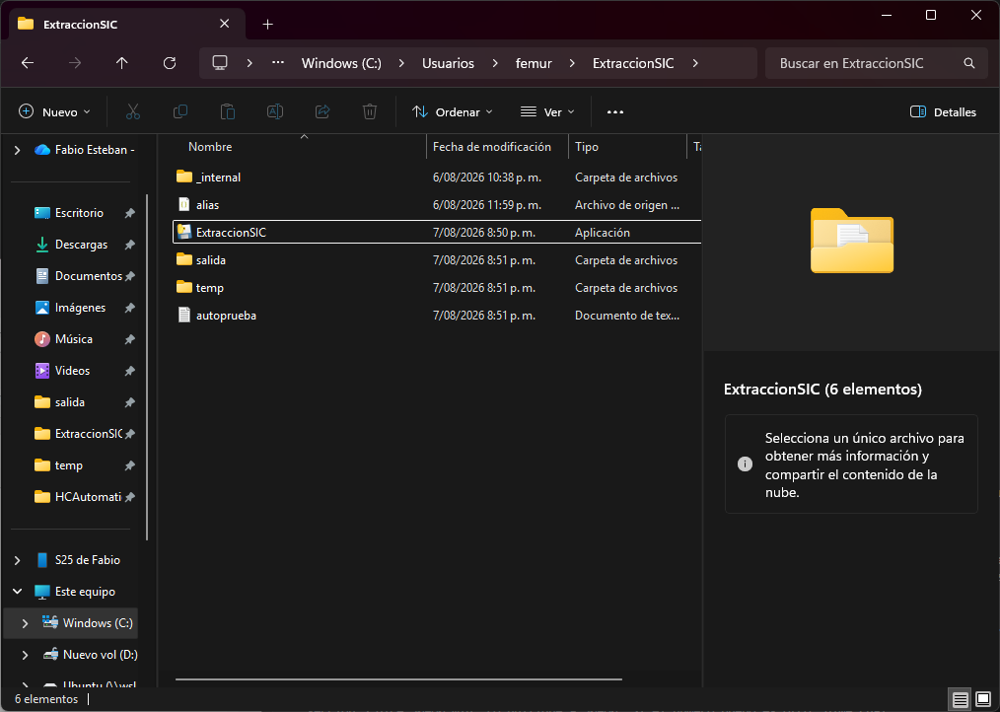
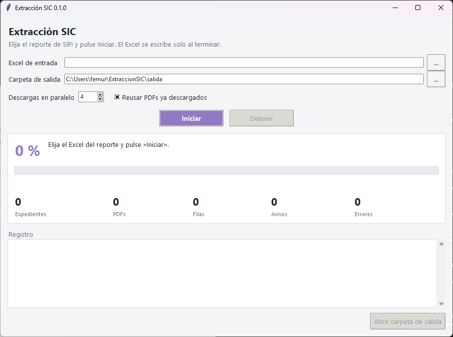

# Extracción SIC — Manual de usuario

Versión 0.1.0 · 8 de agosto de 2026

1. [Qué hace el programa](#1-qué-hace-el-programa)
2. [Instalación](#2-instalación)
3. [La carpeta del programa y la ventana](#3-la-carpeta-del-programa-y-la-ventana)
4. [Ejecutar una extracción](#4-ejecutar-una-extracción)
5. [El Excel de salida](#5-el-excel-de-salida)
6. [Qué hay que revisar a mano](#6-qué-hay-que-revisar-a-mano)
7. [Problemas frecuentes](#7-problemas-frecuentes)

---

## 1. Qué hace el programa

El programa automatiza un trabajo que antes se hacía expediente por expediente a mano.

Se le entrega el Excel exportado desde SIPI (el sistema de propiedad industrial de la
Superintendencia de Industria y Comercio). Por cada expediente del reporte, el programa
entra a su ficha en `sipi.sic.gov.co`, descarga las resoluciones en PDF, las lee y saca de
ellas:

- la **naturaleza** de la marca (nominativa, mixta, figurativa, tridimensional),
- si **hubo oposición** y **quién** la presentó,
- los **artículos** que invocó cada opositor y si su oposición se declaró **fundada**,
- las **causales por las que se negó el registro**,
- si hubo **apelación** a la negación.

El resultado es un Excel nuevo, listo para revisar. Cuando un expediente se niega por
varias causales, sale **una fila por cada causal**, repitiendo el resto de la información.
Los PDFs quedan guardados en el disco por si hay que consultarlos.

Un reporte completo se procesa en menos de una hora. En promedio, alrededor de una fila de
cada cinco queda marcada para revisar a mano: el programa **nunca inventa un dato**, y
cuando no está seguro deja la celda vacía y explica el porqué.

---

## 2. Instalación

No hay instalador y no hace falta permiso de administrador.

1. Clic derecho sobre `ExtraccionSIC.zip` → **Extraer todo**. El Escritorio o
   `C:\Users\<usuario>\Documentos` sirven.
2. Entrar en la carpeta `ExtraccionSIC` y doble clic en **`ExtraccionSIC.exe`**.

> **Hay que descomprimir de verdad.** Abrir el `.exe` desde dentro del `.zip` hace que
> Windows lo ejecute en una carpeta temporal y el programa no encuentra sus archivos.

> **No funciona desde una carpeta de red.** Si la ruta empieza por `\\servidor\...`, el
> programa no arranca. Copiar la carpeta a `C:` o a una unidad con letra asignada (`Z:`).

La primera vez, Windows muestra la pantalla azul *«Windows protegió su PC»*. Es lo normal
en un programa sin firma digital: pulsar **Más información** → **Ejecutar de todas
formas**. Solo hay que hacerlo una vez.

Si el antivirus borra o bloquea el archivo, es un falso positivo habitual con este tipo de
empaquetado: pedir al área de sistemas que añada la carpeta como excepción.

---

## 3. La carpeta del programa y la ventana

| Elemento | Para qué sirve |
|---|---|
| `ExtraccionSIC.exe` | el programa; es lo único que hay que abrir |
| `_internal\` | archivos internos del ejecutable — no tocar |
| `alias.json` | diccionario de nombres cortos de opositores; se puede editar a mano |
| `salida\` | los Excel generados, el registro de cada corrida y los PDFs en `soportes\` |
| `temp\` | archivos de trabajo; **se puede borrar entera** y la siguiente corrida la rehace |
| `autoprueba.txt` | resultado de la comprobación automática que se hace al construir el programa |

Nunca se sobrescribe nada: cada corrida crea un Excel y un registro nuevos, y los PDFs que
ya estaban se reutilizan. En `salida\soportes\` hay un subdirectorio por expediente con
sus PDFs. Un reporte completo ocupa varios cientos de MB.

### La ventana

| Control | Para qué sirve |
|---|---|
| **Excel de entrada** | el reporte exportado de SIPI. Es lo único obligatorio |
| **Carpeta de salida** | dónde se escriben el Excel y los PDFs. Ya viene puesta |
| **Descargas en paralelo** | de 1 a 8. Subirlo no acelera mucho: el cuello de botella es SIPI. Bajarlo a 1 o 2 va más suave si la red va justa o salen muchos errores |
| **Reusar PDFs ya descargados** | marcado, una segunda corrida no vuelve a bajar nada. Sirve para reanudar tras un corte de red |
| **Iniciar** / **Detener** | *Detener* termina los expedientes en curso y escribe el Excel con lo que llevaba: no se pierde el trabajo hecho |
| **Registro** | lo que va pasando, con los avisos y errores según ocurren |
| **Abrir carpeta de salida** | se habilita al terminar |

---

## 4. Ejecutar una extracción

1. Pulsar **…** junto a *Excel de entrada* y elegir el reporte exportado de SIPI.
2. Todo lo demás ya viene puesto. Pulsar **Iniciar**.
3. Esperar. Un reporte completo tarda menos de una hora, según lo cargado que esté SIPI.
4. Al terminar aparece un resumen. Pulsar **Abrir carpeta de salida**.

Mientras corre, el panel muestra el porcentaje, la barra de avance y cinco contadores:

| Contador | Qué cuenta |
|---|---|
| Expedientes | filas del reporte ya procesadas |
| PDFs | documentos descargados en esta corrida (los reutilizados no cuentan) |
| Filas | las que llevará el Excel de salida — **es mayor que «Expedientes»** |
| Avisos | cosas que conviene revisar a mano; están en la columna «Observaciones» |
| Errores | expedientes que no se pudieron leer. **Salen igual en el Excel**, con la celda vacía y la causa |

El Excel se escribe al terminar, no durante la corrida.

Si la corrida se interrumpe o termina con errores, basta relanzarla con el mismo Excel y
**Reusar PDFs** marcado: solo reintenta lo que falló y es mucho más rápida.

---

## 5. El Excel de salida

Las cabeceras van en la **fila 2**; los datos empiezan en la 3. La cabecera **gris** marca
las columnas que vienen del Excel que se entregó y la **amarilla** las que produce este
programa. El expediente de la columna 1 lleva enlace a su ficha en SIPI.

| # | Columna | De dónde sale | Valores |
|---|---|---|---|
| 1 | Número de Expediente | del reporte de entrada | `SD2022/0000017`, con enlace a SIPI |
| 2 | Marca | del reporte de entrada | texto |
| 3 | Naturaleza | **de la resolución** | `Nominativa`, `Mixta`, `Figurativa`, `Tridimensional`, `3D` |
| 4 | Presenta Oposición | **de la resolución** | `Sí` / `No` |
| 5 | Opositor 1 | **de la resolución** | nombre tal como lo escribe la SIC |
| 6 | Nombre corto OPOSITOR 1 | diccionario de alias | vacío si no está en el diccionario |
| 7 | Art OP 1 | **de la resolución** | artículos que invocó, p. ej. `136a, 136b` |
| 8 | Fundada OP 1 | **de la resolución** | `SI` / `NO` |
| 9 | Opositor 2 | **de la resolución** | vacío si solo hubo un opositor |
| 10 | Nombre corto OPOSITOR 2 | diccionario de alias | igual que la 6 |
| 11 | Art Opositor 2 | **de la resolución** | igual que la 7 |
| 12 | Fundada OP 2 | **de la resolución** | igual que la 8 |
| 13 | **MOTIVO Negación** | **de la resolución** | **una sola causal**, p. ej. `136a` |
| 14 | Apelación a la negación | tabla de documentos del expediente | `SI` / `no` |
| 15 | Titular | del reporte de entrada | texto |
| 16 | NIZA | del reporte de entrada | clases |
| 17 | **Motivo #** | calculada | `1`, `2`, `3`… |
| 18 | **Motivos totales** | calculada | cuántas causales tiene ese expediente |
| 19 | **Observaciones** | calculada | qué revisar a mano, en texto claro |
| 20 | Descripción de Productos y Servicios | del reporte de entrada | texto largo; va de última a propósito |

**Las filas moradas** son los expedientes sin opositor: las columnas 4 a 12 quedan vacías
con razón. Si una fila tiene esas columnas vacías y **no** está morada, conviene mirar
«Observaciones».

### Una fila por motivo

Un expediente negado por dos causales genera dos filas idénticas salvo `MOTIVO Negación`:

| Expediente | Marca | Opositor 1 | MOTIVO Negación | Motivo # | Motivos totales |
|---|---|---|---|---|---|
| SD2022/0097089 | BASIC FOODING MILKO | KRAFT FOODS SCHWEIZ HOLDING GMBH | `136a` | 1 | 2 |
| SD2022/0097089 | BASIC FOODING MILKO | KRAFT FOODS SCHWEIZ HOLDING GMBH | `136h` | 2 | 2 |

Por eso el Excel tiene más filas que expedientes: para contarlos hay que filtrar por
`Motivo # = 1`. Las filas de un mismo expediente salen siempre juntas y en el orden en que
las causales aparecen en la resolución.

Un expediente sin causal detectada sale igualmente, con una sola fila y la explicación en
«Observaciones». Ningún expediente del reporte de entrada desaparece del Excel de salida.

### Solo cuentan las oposiciones dirigidas a la clase del reporte

Una solicitud puede cubrir varias clases de Niza y recibir oposiciones dirigidas
expresamente a otras. Por ejemplo, en un expediente de clases 5, 25 y 30, la resolución
puede decir que un opositor *«presentó oposición frente a la clase 25»*: en un reporte de
clase 5, esa fila sale con **Presenta Oposición = No** y las columnas de opositor vacías.

La clase que el programa toma como objetivo tiene que coincidir con el filtro «Good and
Services Class» con el que se exportó el Excel de entrada. Si la oposición no dice a qué
clase va, cuenta: se entiende dirigida a toda la solicitud.

Cuando una oposición se descarta por este motivo, no se hace en silencio: queda anotado en
«Observaciones» con el nombre del opositor y la clase a la que se opuso.

---

## 6. Qué hay que revisar a mano

La columna **Observaciones** es el resumen del trabajo pendiente. El programa prefiere
avisar antes que arriesgar un dato: si algo no se pudo leer con seguridad, la celda queda
vacía y en Observaciones queda escrito el porqué, en texto claro.

Los avisos que sí exigen abrir el PDF en `salida\soportes\`:

| Aviso | Qué significa |
|---|---|
| *no se pudo determinar la causal* | La resolución niega el registro pero no se pudo leer con qué artículo. Hay que mirarlo en el PDF |
| *revisar esta fila a mano* | El dato extraído no cuadra con lo esperado y conviene comprobarlo |
| *el opositor invoca más artículos de los que se pudieron leer* | La columna «Art OP» quedó incompleta: faltan artículos |
| *el reporte dice «Bajo Oposición = …» y la resolución dice lo contrario* | El Excel de entrada y la resolución no coinciden. Manda la resolución, pero conviene verificarlo |
| *se opuso solo a la(s) clase(s) …* | Había una oposición y se dejó fuera a propósito, por ir dirigida a otra clase |

El resto de avisos son informativos: explican por qué una celda quedó vacía, y en la
mayoría de los casos no hay nada que corregir.

La columna **Nombre corto** sale del diccionario de alias, no se deduce (`RED BULL GMBH` →
`RedBull` es criterio humano). Si un opositor no está en el diccionario, la columna queda
vacía y no pasa nada más. Se puede completar editando `alias.json` con un editor de texto:
es una lista de pares *nombre completo* → *nombre corto*.

---

## 7. Problemas frecuentes

| Síntoma | Qué hacer |
|---|---|
| El antivirus borra o bloquea el programa | Falso positivo del empaquetado. Pedir a sistemas que añada la carpeta como excepción |
| «Windows protegió su PC» (pantalla azul) | Es la advertencia de programas sin firma. *Más información* → *Ejecutar de todas formas*. Solo la primera vez |
| «Windows no encuentra el archivo "\"» | El programa está en una carpeta de red. Copiarlo a `C:` o a una unidad con letra |
| «No se pudo escribir "…xlsx": el archivo está abierto en Excel» | Cerrar el Excel de salida y reintentar. El programa no toca un archivo abierto |
| Muchos errores de red seguidos | SIPI está caído o limitando el ritmo. Bajar «Descargas en paralelo» a 2, esperar y relanzar. Si el sitio abre en el navegador pero el programa falla, suele ser un proxy corporativo: no está soportado |
| La corrida se interrumpió o terminó con errores | Relanzarla con el mismo Excel y **Reusar PDFs** marcado. Es normal que la primera pasada deje errores si SIPI está cargado |
| El Excel tiene más filas que expedientes | Es lo esperado: una fila por causal. Ver [Una fila por motivo](#una-fila-por-motivo) |
| La columna «Nombre corto» sale vacía | Ese opositor no está en el diccionario de alias. Ver la sección anterior |
| Tarda demasiado | Menos de una hora es lo normal. Si tarda mucho más, el problema es la red: bajar «Descargas en paralelo» a 2 |

Si hay que reportar un fallo, el archivo de registro de la corrida está en `salida\` con la
fecha y la hora en el nombre: contiene todo lo que ocurrió, incluido el detalle técnico de
cada error.
